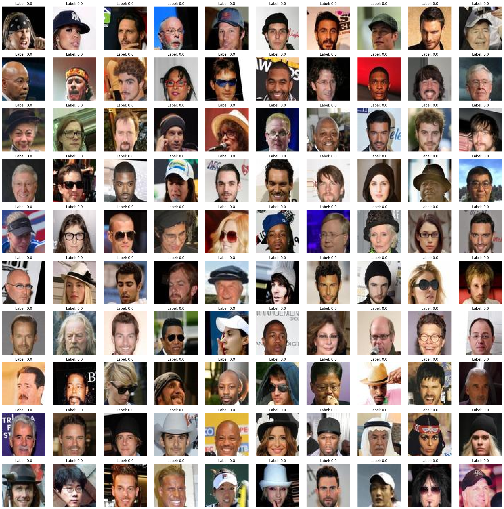

## CLASSFICATION DE VISAGE ## 

Minimization of the HTER (Half Total Eror Loss) on face images.
The dataset comprises 87898 label 1 and 12102 label 0. 
The objective is to classify those two labels. 

After a rapid visual analysis of the data, the classification does not look possible naked eye.
The labels are not attributed according to gender, aging skin, features (hat, glasses), or background.
For this reason, I chose a deep model.
I choose the archotecture as a classic convolutional network to detect human faces in color images.

# Images in the dataset
## Label 0

## Label 1

# Predicted labels
## Predicted label 0

## Predicted label 1

